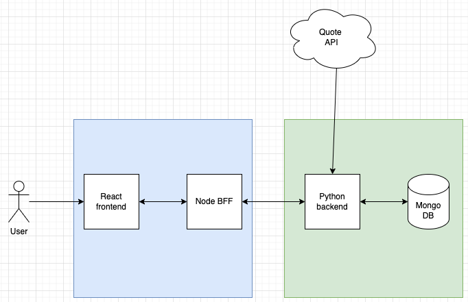

# Full Stack Notes Application with React (Frontend), NodeJS(BFF) and Python with MongoDB (Backend)

This project includes a React frontend, a Node.js server, a Python Flask backend, and a MongoDB database. Follow the instructions below to set up the project on your local machine.

---

## Overview

For more details on overview, key features, technical implementation please read [OVERVIEW.md](/OVERVIEW.md).

---

## System Architecture Diagram:

- The diagram below illustrates the architecture for this app.

---

## Setup

Follow the pre-requisites and setup instructions to start the app as given in [SETUP.md](/SETUP.md)

---
